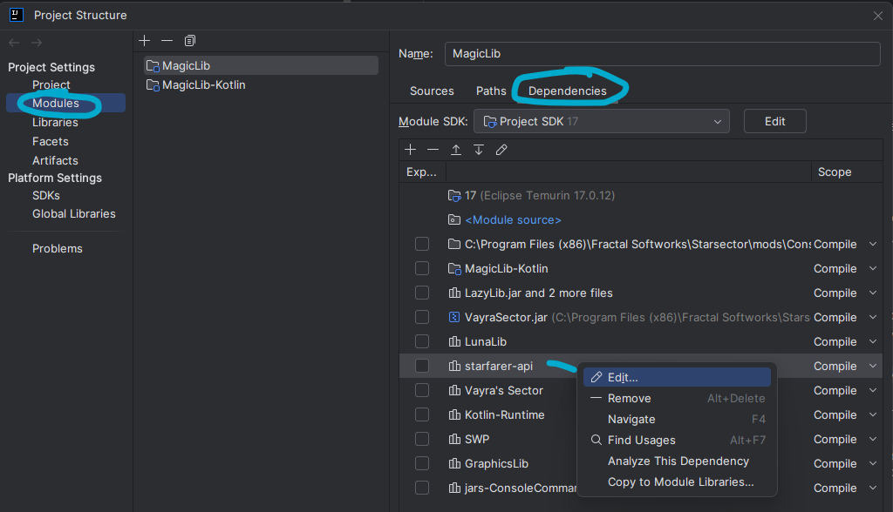
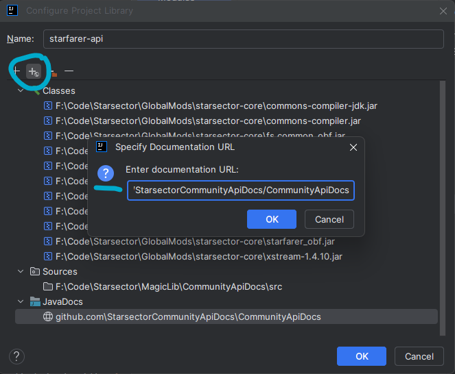
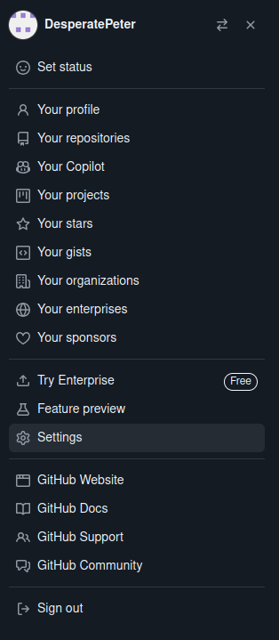
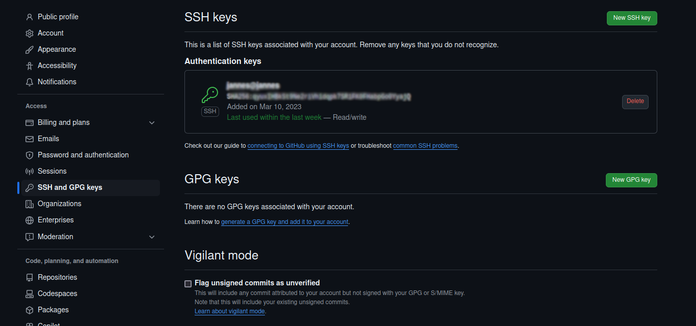

# Starsector Community API Docs

Online at <https://starsectorcommunityapidocs.github.io/CommunityApiDocs/>.

## What is this?

This is a community-driven effort to document the Starsector API for modders. It starts with the official API, then builds on top of it,
patching the large gaps, adding examples, and documenting "gotchas".

## To Use (for modders)
Replacement for the official Starsector API docs. If you'd like to **Contribute**, jump to the [Contribute](#To-Contribute) section.

_This guide is for **IntelliJ**, but should be easy enough to adapt to other IDEs (or none). Please feel free to add
instructions for other IDEs._

1. Open the Project Structure (`File -> Project Structure`).
2. Go to `Modules -> Dependencies`.
3. Find your existing dependency on `starsector-core`. 
4. Click "Edit", then "Add Documentation URL".
    1. Enter `https://starsectorcommunityapidocs.github.io/CommunityApiDocs`.

Steps 1-3:

   

Step 4:

 

## To Contribute

### Setup guide

_This guide is for **IntelliJ**, but should be easy enough to adapt to other IDEs (or none). Please feel free to add
instructions for other IDEs._

_If you are setting up a new mod and have already followed these steps for a different mod, skip to step 4 (add git root)._

1. Request to join the Team here: <https://github.com/orgs/StarsectorCommunityApiDocs/teams> (search for "Contributor").
   1. If that doesn't work, ping an owner on Discord or something.
   2. Unfortunately, there is no way to automatically add you to the team, so you will need to wait for a maintainer to
      approve your request (if someone knows a way, please let us know).
3. Clone the repo:
    1. If you haven't already, connect IntelliJ to your GitHub account by going to `File -> Settings -> Version Control
       -> GitHub` and adding your account there.
    2. Within IntelliJ, with a project open (e.g. your mod), go to `File -> Open -> Get from Version Control` .
    3. First, choose a Directory. This should be wherever you put your coding projects, such as next to your mod folder (but not within it).
    4. Then, enter `git@github.com:StarsectorCommunityApiDocs/CommunityApiDocs.git` for the URL.
    5. Hit `Clone`.
4. Add the git root to IntelliJ, making it easy to update and commit your doc edits: 
    1. If you use Gradle, follow the [Gradle](#Gradle) section instead of this step. If you don't know what that is or don't use it, continue here. 
    2. Open the IntelliJ settings and navigate to `Version Control -> Directory Mappings`.
    3. Click the `+`, then navigate to and add the `CommunityApiDocs` folder that was just created.
5. Set your mod's dependency to be on the new git submodule.
    1. Open the Project Structure (`File -> Project Structure`).
    2. Go to `Modules -> Dependencies`.
    3. Find your existing dependency on `starsector-core`.
    4. Edit it, leaving all _Classes_ the same, but adding/changing the _Sources_ to the `CommunityApiDocs/src`
       folder (so, the `src` folder inside the `CommunityApiDocs` folder that you cloned in step 3).
        1. You should now have a _Sources_ entry that looks like `<folder path>/CommunityApiDocs/src`.
        2. Note! If there is a **URL** for documentation on `starsector-core`, you should remove it, otherwise you won't see your own changes until they're online. You want to see them as soon as you make them, before you push them online.
6. All done!
    1. Now, when you navigate to vanilla source code, it will open up the Community API Docs instead, which you can
       edit.
    2. You'll also see the documentation from the Community API Docs in the tooltips and quick documentation.
    3. Make sure to update the `CommunityApiDocs` every so often to get the latest changes. The default hotkey for this is `Control-T` on Windows/Linux.
    4. When you make changes, you'll see them show up in the IntelliJ `Commit` tab (found on the left side of IntelliJ
       by default).

#### GitHub ssh-key
This step is needed to use `git` on the command line. If you use it only through IntelliJ buttons, it shouldn't be required.

If you haven't already, generate an [ssh-key for Github](https://docs.github.com/en/authentication/connecting-to-github-with-ssh/generating-a-new-ssh-key-and-adding-it-to-the-ssh-agent).

Otherwise, adding a submodule or pushing via ssh won't work.

Expand the section below if you want to verify that your ssh-key is set up correctly.

<details>
On GitHub, got to "Settings":



Then go to "SSH and GPG keys" and make sure that there is an active ssh key for your account:



Lastly, open a file explorer (WIN+E) and go to your user folder (e.g. C:/Users/myName) and make sure that there is a
folder called .ssh. Inside that folder, there should be one or more files ending in .pub. Make sure that the contents of
one of those files match the key displayed in GitHub. If not, create a new key, following the tutorial linked above.
</details>

#### Including the community docs as a submodule

If you are familiar with git submodules or not using **IntelliJ**, you might want to include the api as a submodule to
your project. A submodule is essentially a nested git repo, or a repo within a repo.

##### Git CLI
<details>

This part details how to add the submodule via **git command line interface**. 
Other git clients will offer similar functionality.

To easily be able to use the git CLI, make sure to add the submodule via SSH:

```shell
git submodule add git@github.com:StarsectorCommunityApiDocs/CommunityApiDocs.git
```

If you want to commit/push your changes, simply navigate into the CommunityApiDocs folder and follow your
usual workflow for commiting/pushing. No additional steps are required.

After you have commited changes in the submodule, you will notice that the submodule will have changed in your parent
repository. You can just add & commit the changed submodule.

If you clone your repository at a later date, simply clone it with the --recurse-submodules flag or run
```shell
git submodule update --init
```
after cloning.
</details>

##### Gradle
<details>
This part is only relevant if you are using **Gradle** as a build system.

In order for your IDE to find the source files and allow you to navigate to them, you can add them as a dependency.
To do so, in the dependencies section of your, add the following:

```kotlin
    compileOnly(fileTree("$projectDir/CommunityApiDocs/src/com/fs/starfarer/api"){
        include("*.java")
    })
```

Double-check the path to make sure it matches the submodule path.

Note that this might not be the optimal or most canonical solution, but it did work for me.
</details>

### Writing Good Documentation
_Needs work_

Read: https://codelucky.com/java-documentation/

#### Writing code examples

For more complex to use methods/classes/interfaces, it makes a lot of sense to provide code examples to give other modders
a good idea how a possible usage could look like. Unfortunately, adding code examples to javadoc can be a bit tricky at
times. Some examples, like the ones provided in the article above, simply do not work. Furthermore, IntelliJ seems to
get in the way rather than help when writing code examples within javadoc.

Therefore, I would suggest you write the code example in a java file, such as e.g. a scratch file 
(File > New > Scratch File > Java).

Then, copy the code from that scratch file and paste it into your documentation. You should wrap the block in both a
\<pre>\</pre> and \<code>\</code> tag and escape any @... within the code as {@code @...}.

The result could look something like this:

```java
 /**
  * <p>Example:
  * <pre>
  * <code>
  *    // given an object of type OptionPanelAPI named options
  *	options.addOption("My story option [1SP, 0% XP]", "myData (can be any type)", Misc.getStoryOptionColor(), "tooltip (can be null)");
  *	options.addOptionConfirmation(
  *		"myData (can be any type)",
  *		new BaseStoryPointActionDelegate() {
  *			{@code @Override}
  *			public String getLogText(){ return "this appears in the log"; }
  *			{@code @Override}
  *			public int getRequiredStoryPoints(){ return 1; }
  *         // [...]  remaining methods not shown for brevity
  *		}
  *	);
  * </code>
  * </pre>
  */
 void addOptionConfirmation();
```

Note that IntelliJ tends to display the indentation of comments wrong and generally speaking mess up your indentation.
I don't know why and don't know how to fix that.

## For Maintainers

### Tasks

#### Annual task: git submodule  <https://github.com/StarsectorCommunityApiDocs/StarsectorJarsPrivate.git> not found

When the Private Access Token (PAT) expires each year, it needs to be regenerated and updated.

StarsectorJarsPrivate is a private repo that contains Starsector's jar files, needed for `javadoc` to run. It requires a
PAT for the Actions runner to clone it.

1. Go to <https://github.com/settings/tokens>. Generate a new token:
    1. Resource owner: StarsectorCommunityApiDocs.
    2. Expiration: max
    3. Repository access: All repositories
    4. Permissions: Repository Permissions: Contents (read).
    5. Generate token. Copy it.
2. Go to <https://github.com/StarsectorCommunityApiDocs/CommunityApiDocs/settings/secrets/actions>.
3. Make a Repository Secret with the name `PRIVATE_REPO_PAT`.
4. Rerun the Actions script and it should work.

#### Game update task: Update game jars

1. Go to <https://github.com/StarsectorCommunityApiDocs/StarsectorJarsPrivate>.
2. Remove those and replace them with the ones in your own starsector-core folder (sort by: type, scroll to jars).
3. Re-run the Actions script to update the docs.

## Attributions

Dracula-javadoc was used to achieve a dark theme

Dracula-javadoc is licensed unter the MIT License

### MIT License

MIT License

Copyright (c) 2019 Allan Im

Permission is hereby granted, free of charge, to any person obtaining a copy
of this software and associated documentation files (the "Software"), to deal
in the Software without restriction, including without limitation the rights
to use, copy, modify, merge, publish, distribute, sublicense, and/or sell
copies of the Software, and to permit persons to whom the Software is
furnished to do so, subject to the following conditions:

The above copyright notice and this permission notice shall be included in all
copies or substantial portions of the Software.

THE SOFTWARE IS PROVIDED "AS IS", WITHOUT WARRANTY OF ANY KIND, EXPRESS OR
IMPLIED, INCLUDING BUT NOT LIMITED TO THE WARRANTIES OF MERCHANTABILITY,
FITNESS FOR A PARTICULAR PURPOSE AND NONINFRINGEMENT. IN NO EVENT SHALL THE
AUTHORS OR COPYRIGHT HOLDERS BE LIABLE FOR ANY CLAIM, DAMAGES OR OTHER
LIABILITY, WHETHER IN AN ACTION OF CONTRACT, TORT OR OTHERWISE, ARISING FROM,
OUT OF OR IN CONNECTION WITH THE SOFTWARE OR THE USE OR OTHER DEALINGS IN THE
SOFTWARE.
